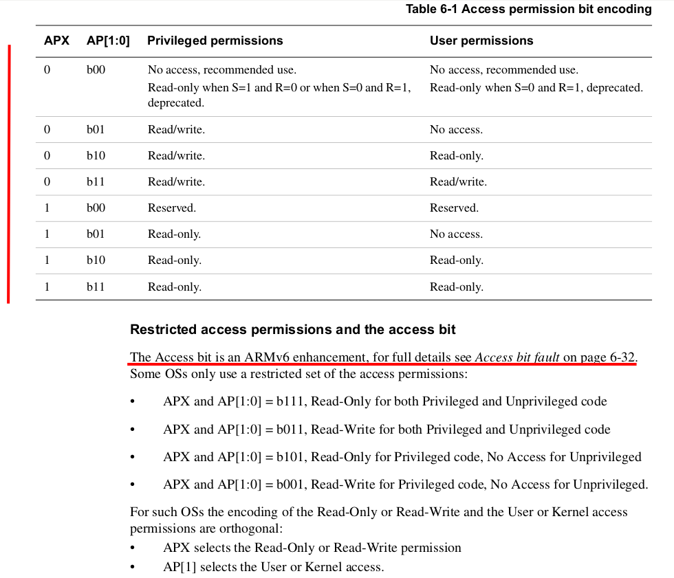

## Simple user processes

***Make sure you define `CS340LX_2021_PATH` to point to where-ever your cs340
repository is, just as you did with `CS240LX_2021_PATH`.***

Today we are going to do a very simple user process: only one, and only has
1MB.  This will be the initial `init` process that starts everything
off.  Over the weekend you should read through the checked-in ARM virtual
memory documents so we can do something more intelligent next lab:
  1. More than one process.
  2. OS aliased in the top half of memory (as it normal), user with a 
     different page table in the lower.

Perhaps surprisingly,  over the past few labs you've already built up
most of the pieces you need for user processes --- system calls, running
code at `USER` level, virtual memory.  The next few labs -purposes and
re-package these pieces into a more coherent, explicit user-process
interface.

We're going to build our code so that you can compile a pi program
*without modification* to either:
  1. Run identically to how our `.bin`s work now --- as the sole program
     running on the hardware in `SUPER` mode, with complete control over
     the hardware.

  2. Run at user-level and call system calls do to actions it cannot
     do directly, such as privileged instructions, co-processor
     modifications, page table or TLB changes, etc.

After the next couple of labs you should be able to take cs140e or cs240e
device labs and recompile and run them at user level.   (Note: we will
have to add tricks to for interrupts and hard real-time guarantees needed
by neopixels.)

NOTE: 
   * As a bonus, after doing the next set of labs, we may (I think)
     be a good part of the way to being able to make a simple virtual
     machine monitor (VMM) implementation and then run your old `.bin`
     programs without any modification or even recompilation.   We will
     have to handle some additional issues, but I'm hoping we can do a
     bunch of programs in three ways --- either as kernel programs (as
     now), as user programs (as above) or as guest OSes running on top of
     a VMM.  Doing each three ways, without modifying them, gives a really
     good understanding of the different approaches and their tradeoffs.

Over the rest of the labs we'll build up to a more full-featured OS.
Our approach will be sort-of based on exokernel stuff in that much of
the OS functionality will be in an unprivileged library (a "library OS")
and the kernel will mostly do protection stuff.  The goal here is to take
as much resource management as possible out of the kernel (where it can't
be modified by unprivileged code) and put it into a library where anyone
can tweak, replace or swap out different implementations.  The kernel
still provides protection so that one application cannot destroy another.

I haven't thought about exokernels in about two decades, so no guarantee
I'll be talking about The Approved Way to do things, but it's an
interesting exercise for embedded --- compared to applications on a
general purpose OS, embedded apps often want more control, have to deal
with more constrained resource limits, higher cost of bugs (no one even
likes it if their toaster crashes, much less their card) and strict
time requirements (latency, guarantees) that simply don't exist in the
general purpose setting.

-----------------------------------------------------------------------
### The basic idea

You'll have to do several things:
  1. Implement a system call for each `libpi` operation you do that
     modifies either privileged hardware or kernel state.  In many cases
     you will not make an identical system call as the pi but instead
     decompose the implementation into smaller pieces that become low
     level system calls.  Doing so will often give more flexibility.

  2. Write a new library OS that implements `libpi` functionality at
     unprivileged level either by calling system calls outright or by
     building up equivalent functionality from smaller ones.

  3. Setting up kernel state well enough that you can run the first
     program.

In the next few labs we will build several interesting pieces:

  1.  A `fork` implementation that forks (duplicates) the current
      running process.  Doing so is mentally a bit fancy because unlike
      all other `fork()` implementations, this one clones the address
      space that it itself is running in.  It's not much code, but you
      have to think.

   2. A simple `pipe` implementation that can send and receive data from
      a different address space.  From this you can build arbitrary
      communication.   This is not hard to build but it's an interesting
      piece to have --- in particular, I'm hoping we can tune it so that
      our performance ping-ponging data between processes on the pi is
      significantly faster than your MacOS or Linux implementation on
      your laptop can do.

   3. Signal handling so that you can receive different exceptions at
      user space quickly.  Similarly to fork, I'm hoping that --- as in
      the original exokernel paper --- we can be significantly faster
      than a general purpose OS.  If not immediately, at least after
      some tuning.

In much of this we will be using memory tracing to make sure that
all GPIO output (or all output at all) is the same as we do different
modifications.

-----------------------------------------------------------------------
### Part 1: hello-world at kernel level

In this part you'll run the `init` program just at kernel level, no system
calls, to make sure you can install and jump to it correctly.

At the top level of your cs340lx repository, there are two new directories:
  - `pix`: this is the start of trivial exokernel-influenced pi OS.  This
    code is what runs at privileged level (as our previous programs have),
    and interacts directly with the hardware. You'll be adding code here
    to handle different system calls.

    For the moment don't modify the two header files since I will
    be adding interfaces as soon as I can figure things out better.
    (It's been awhile since I've exo-d anything, and there are some
    tricky issues here, such as the tradeoff between Doing Things Right
    and Keep It Simple --- feel free to discuss ideas you have on this
    or other topics!)

  - `libos`: start of trivial library OS our programs will use.  This code
    runs unprivileged at user model.  Surprisingly, with the right system
    calls supplied by `pix` it will be able to do lots of things you
    might think only an OS can do.  You will add your `libpi` emulation
    code here and implement system calls into `pix`.

For this part:
  1. The binary of a hello program is in `pix/init-hack.h`.  It has
     the first address it expects to run at as its first word.  If you
     look in `init-hack.h` you will see the first word is `0x00800000`
     which is where it expects to be loaded at --- there is nothing
     special about this address, other than it is low enough to be in
     physical memory and we know it is not used for anything.  This is
     not a limit of processes in general --- it's just a limit of the
     very first user-level process.

  2. When `pix` is compiled, the array holding the init code (`code_init`)
     will be compiled in as well.   In pix: write code to copy `code_init`
     to the right place and jump to it --- make sure you jump over the 
     first word (that specifies the link address) since that won't be a useful
     instruction.  It should print some kind of
     hello message.

  3. Pull your MMU code (from the last lab) into pix and make sure
     the above still works when you enable the MMU.

  4. Finally, go into your `libos` directory and write a simple linker
     script that will work just like our current `libpi/memmap` but (1) link
     the code at  `LIBOS_CODE_START` (`0x00800000` in `libos-asm.h`) and 
     (2) insert the value of the linked
     address as the first word in the binary.  There is a reasonable
     `memmap.fixed` you can steal from the cs140e `11-fuse` lab.

     Go to the directory `code/0-hello` and test that doing everyting from
     scratch works:

            make 
            make make-init

     Should generate the `init-hack.h` from scratch and link it into
     your pix code and run it.  If this doesn't work, I probably screwed
     something up, not you so yell immediately!

-----------------------------------------------------------------------
### Part 2: hello-world at user level

Now you'll start going through an implementing the system calls so
that you can run the hello program at user-level without access to
kernel memory.

`pix` modifications:

   1. Instead of jumping to the code directly, you will have to switch to
      `USER` mode (use the `cps` instruction and do a prefetch flush).
      You already have done this in the previous labs --- I would not
      use that code directly, but instead only do a `cps`, flush, and
      then jump.  If we cared about privacy, we would clear the registers
      first, but for the moment we don't worry about this.

   2. Pull in your system call code from before and make it jump to the
      `do_syscall` routine provided in `pix`.  You can see this
      is setup for two system calls (`sys_exit` and `sys_putchar`).
      To give you exposure to the other main method of system calls we
      are doing this *not* by hard-coding the system call number in the
      `swi` instruction, but by passing the number in `r0`.  This makes
      writing code that can call different system calls easier since you
      don't have to write out each trampoline with a hard-coded `swi`.
      The downside is that it uses an additional register.

`libos` modifications:

  1. `start.S` --- copy `libpi/start.S` and rewrite it to handle a program
     running at user level.  Remove the privileged stuff, set the stack
     pointer to the end of the 1MB address that our `init` runs at, call
     `cstart` and then call `sys_exit` if it returns.

  2. Finish implementing `syscall.S` (not much to it).
     
To test it:

  1. Compile `code/1-hello`.
  2. Look at `hello.list` to make sure its linked correctly (the first word
     should be `0x00800000`).  
  3. Then do `make make-init` to link it into pix and run.  

If things do not work, you'll have to start trimming things down.
This first hello uses `sys_putchar` to emit the characters (since there
are less moving pieces).  If it works, then try `2-hello`.

-----------------------------------------------------------------------
### Part 3: prevent user writes

Currently, the user could write to any location in the kernel.
Not impressive.   Using our existing tools, you could imagine setting
up a user domain id and a kernel domain id and switching between them.

The ARM gives a better approach: as you can see in the picture, if you
set the `APX` bit to 0 (`mmu.c` does this by default) and the `AP` bits
to 0b01, then the kernel will have read/write access but the user will
have no access.  If you set to `0b10` the user will have read access.

<table><tr><td>
  
</td></tr></table>

So for this, set up the permissions so the user cannot crash things.
*NOTE*: if you make the code that switches from `SUPER` to `USER` not
readable at kernel level, then your code will crash.  Think about about
why this is --- Akshay figured this out when my brain was crashing last
night :)

The four tests check that increasingly stringent permissions work:

  - `3-crash` that a write to unmmaped memory is caught.  This should work before you
    change anything.  Make sure you can determine the `pc` and the crashing 
    address as well as whether it was a load or store.
  - `4-ap-fault-read`: this reads a GPIO address and sees that you get a fault.
  - `5-ap-fault-write`: this writes a GPIO and sees that you get a fault.  
  - `6-null-fault`: this is trickier.   We currently do not get null faults because
    we run code in the lower 1MB so cannot remove read access.  Here, if you take
    your switching instructions and copy the to your stack (so they are not 
    in the lower 1MB) and jump to them there, then you *can* mark the low 1MB as
    inaccessible.   This is sort of like our dynamic code generation lab but you
    can use the hard-coded instruction values.
